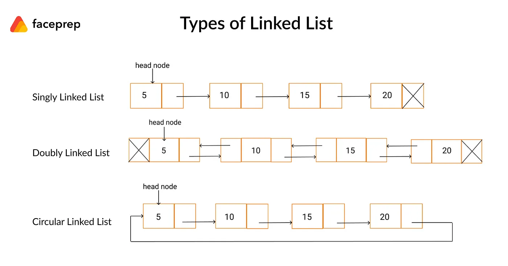

# Algorithm and Data Structure Rust Ver. Notes

## Sorting Algorithms

### 1. Bubble Sort

Bubble sort is one of the simplest sorting algorithms, the time complexity of this sorting algorithms is $O(n^2)$

the pseudo code of the this sorting algorithm can be expressed as:

```pseudocode
for i in range from 0 to array_length:
	for j in range from 0 to array_length - i -1:
		swap array[j] with array[j+1] if array[j] > array[j+1] 
```

A better version of this algorithm is add a flag in the first iteration. If the array is already sorted, then return it directly.

### 2. Selection Sort

Selection Sort is another simple sorting algorithm. it selects the smallest element in the rest of the array and place it  ahead. its pseudo code can be expresses as:

```pseudocode
for i in range from 0 to array_length -1:
	find index of the smallest element in the rest of the array,
	swap(i,smallest element)
```

The time complexity is also $O(n^2)$, because finding the smallest element in an array needs to iterate over the array.

### 3. Insertion Sort

Insertion Sort is a simple sorting algorithm as well. It picks one element at a time and inserts the element into the place where it should be.  The pseudo code can be written as:

```pseudocode
for i in the range from 1 to array_length:
	let current element be the element at index i
	while array[i-1] < array[i], swap (i-1,i), i -= 1.
```

The time complexity of this algorithm is $O(n^2)$.

### 4. Merge Sort

Merge Sort is a recursive sorting algorithm. It divides the original array into two pieces of equal size, and sort them respectively. The pseudo code of this algorithm is:

```pseudocode
divide the array into left half, right half:
if the length of the array is smaller or equal to 1, returns
merge sort the left half
marge sort the right half
init a new array to store the result
for elements in left half, and elements in right half
	Place the smaller elements of the two arrays one by one into the new array
returns the new array
```

The time complexity of this sorting algorithm is $O(n\log_2 n)$ , but it takes larger memory space than the first three sorting algorithms. the space complexity of this algorithm is $O(n)$ , while the space complexity of the first three algorithm is $O(1)$

### 5. Quick Sort

Quick Sort is another recursive sorting algorithm. It use a unique techniques called "pivot". "pivot" is select an element in an array, and moves it to its rights place, where all the elements before it are smaller than it, and all the elements after it are greater than it. The pseudo code for pivot can be expressed as:

```pseudocode
select an element in the array, lets call it pivot point (usually the first element)
for every elements in array:
	if the element is smaller than pivot point:
		moves it before the pivot point,
```

The pseudo code for the Quick Sort then can be expressed as:

```pseudocode
pivot the array.
recursively pivot the elements on the right side of the pivot point,
recursively pivot the elements on the left side of the pivot point.
```

In the average cases, the time complexity of this algorithm is $O(n\log_2 n)$ and the space complexity of this algorithm is $O(n)$

## Data Structure

### 1. Linked List



A **linked list** is a linear data structure that consists of a series of nodes connected by pointers. Each node contains **data** and a **reference** to the next node in the list. Unlike arrays, linked lists allow for **efficient insertion or removal** of elements from any position in the list, as the nodes are not stored contiguously in memory.

There three types of linked list: singly linked list, doubly linked list, and circular linked list. singly linked list is the simplest one, it only contains a reference to the next node. doubly linked list contains two references, one to the next node, and one to the previous node. circular linked list is a linked list where the last node points to the first node.

In the rust implementation, to avoid the recursive reference, we use the `Rc<T>` to wrap the reference to the next node, and `Weak<T>` to wrap the reference to the previous node.

## Supplementary Materials

### 1. A Stepper

we can use for-loop iterate over our struct if we have implemented `Iterator` for our struct:

```rust
pub struct Stepper{
    current: i32,
    step: i32,
    max: i32,
}

impl Iterator for Stepper {
    type Item = i32;

    fn next(&mut self) -> Option<Self::Item> {
        if self.current > self.max{
            return None;
        }
        let res = self.current;
        self.current += self.step;
        Some(res) 
    }
}
```

### 2. Pseudo Random Generator Algorithms

Generating a pseudo random number involves take modulo on large integer. To generate a large integer, we can define few steps to calculate a random integer:

``` rust
pub struct RandomGen {
    cur: usize,
    mul: usize,
    inc: usize,
    modulo: usize,
}

impl RandomGen {
    pub fn new(seed: usize) -> Self {
        RandomGen {
            cur: seed,
            mul: 56394237_usize,
            inc: 346423496_usize,
            modulo: 25254463563_usize,
        }
    }

    pub fn rand_usize(&mut self, max: usize) -> usize {
        self.cur = (self.cur * self.mul + self.inc) % self.modulo;
        self.cur % max
    }
}
```

Here, the `mul`,`inc`,`modulo` are just random numbers. In case of overflow, we can use external crate to define these integers to be large numbers (e.g. array of i32 that implements basic math operations).
